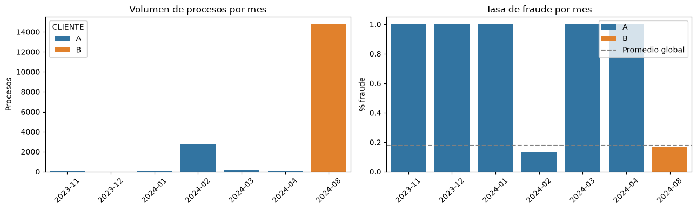
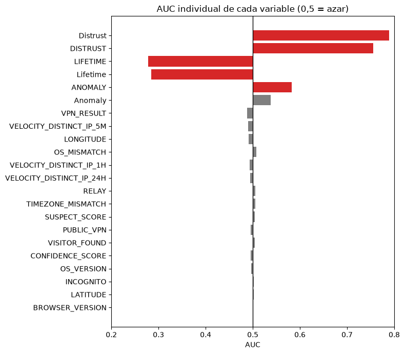
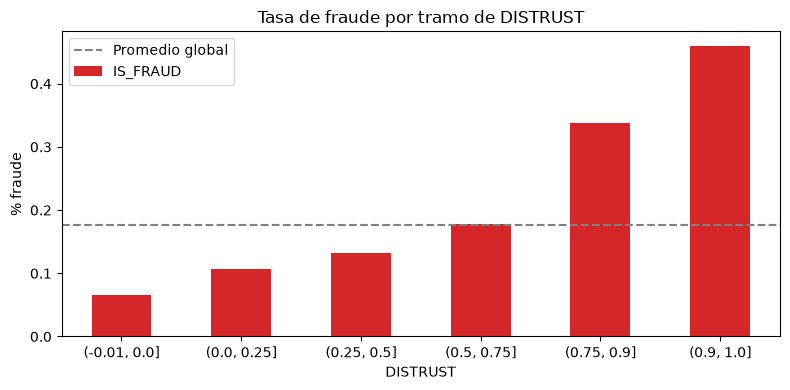
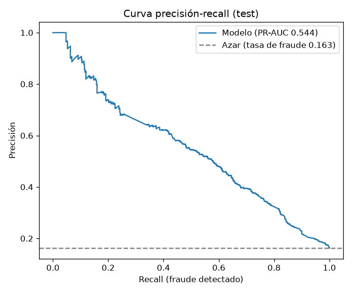
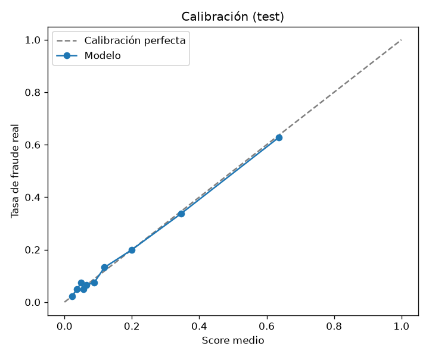
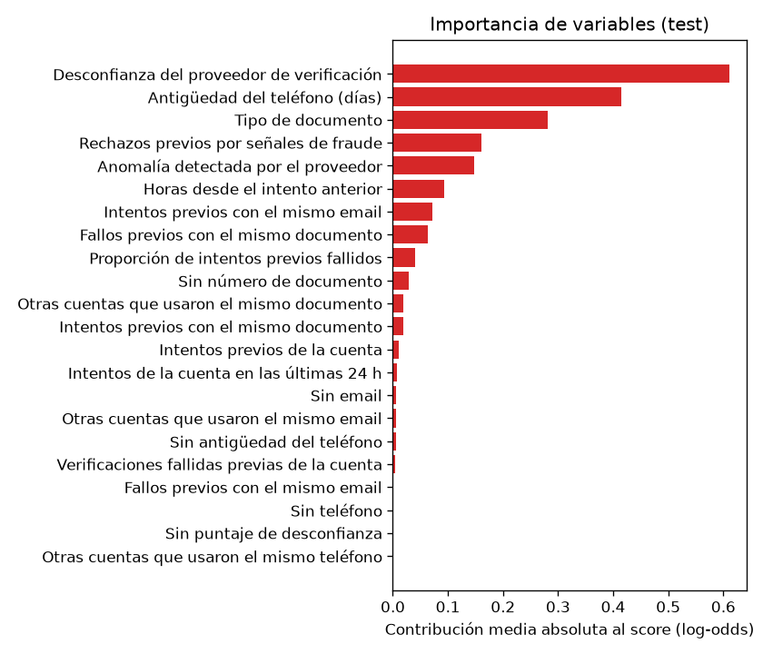
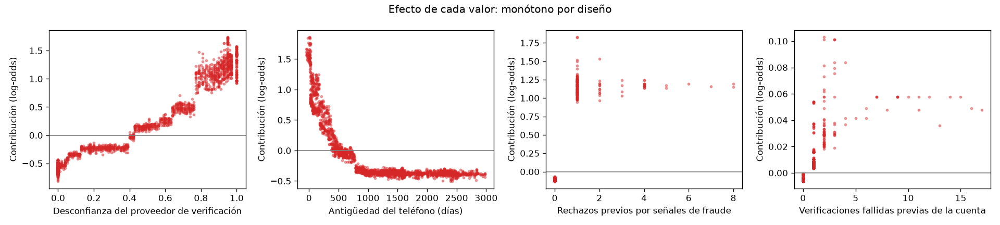
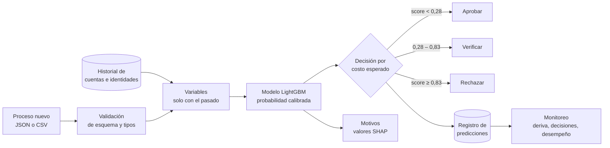
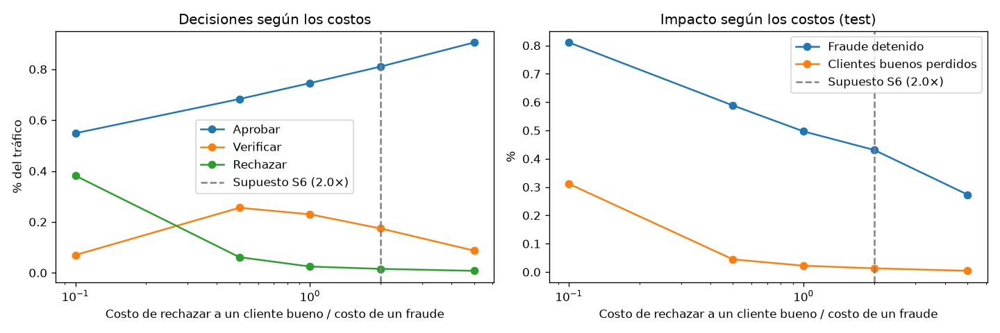
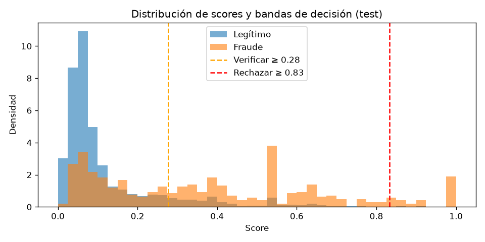

# Detección de fraude en verificación de identidad: análisis extendido

**Contenido**

1. [Resumen](#1-resumen)
2. [El problema y el tipo de fraude](#2-el-problema-y-el-tipo-de-fraude)
3. [Supuestos](#3-supuestos)
4. [Análisis exploratorio](#4-análisis-exploratorio)
5. [Preparación de datos y variables](#5-preparación-de-datos-y-variables)
6. [Modelado](#6-modelado)
7. [Evaluación](#7-evaluación)
8. [Sistema en producción](#8-sistema-en-producción)
9. [Escenarios](#9-escenarios)
10. [Limitaciones y consideraciones](#10-limitaciones-y-consideraciones)

---

## 1. Resumen

La empresa XX vende productos agrícolas en línea y necesita estimar el riesgo de fraude de cada
transacción para aprobar o rechazar automáticamente, casi en tiempo real. Los datos entregados
corresponden al **proceso de verificación de identidad** que ocurre antes de aprobar la operación:
17.781 intentos de 12.206 cuentas, de dos clientes, entre noviembre de 2023 y agosto de 2024, con
17,7 % de fraude.

**Resultado principal.** Un modelo LightGBM con 22 variables alcanza en el conjunto de prueba un
**PR-AUC de 0,544** (intervalo de confianza del 95 %: 0,43–0,64), frente a 0,163 de un clasificador
al azar, y un **ROC-AUC de 0,811**. Sus probabilidades están bien calibradas, lo que permite
decidir directamente por costo esperado, y es **monótono por diseño**: más señal de riesgo nunca
baja el score, y cada decisión llega con sus motivos en lenguaje legible.

| Decisión | Regla | Tráfico | Fraude en la banda |
|---|---|---|---|
| Aprobar | score < 0,28 | 81,0 % | 8,5 % |
| Verificar (OTP, nueva selfie o analista) | 0,28 ≤ score < 0,83 | 17,4 % | 46,1 % |
| Rechazar | score ≥ 0,83 | 1,5 % | 90,7 % |

Con el supuesto de que rechazar a un cliente bueno cuesta el doble que aprobar un fraude, el sistema
**detiene el 43 % del fraude**, pierde el **1,3 % de los clientes buenos** (solo el 0,17 % por
rechazo directo) y **reduce el costo un 24,5 %** frente a no tener modelo.

**Lo más importante del análisis** no es el número final sino tres hallazgos sobre los datos, que
determinan qué tan lejos se puede llegar y cómo hay que medirlo:

1. **Las 25 columnas de dispositivo, red y geografía fueron aleatorizadas** por la anonimización.
   Un modelo con todas ellas obtiene AUC 0,49, igual que con la etiqueta barajada al azar.
2. **Los datos vienen de dos clientes con esquemas distintos** y periodos que no se solapan.
3. **Hay meses con 100 % de fraude** (sesgo de selección), que inflaban el PR-AUC de 0,52 a 0,62.

El desempeño está **limitado por la información disponible, no por el modelo**: las 25 columnas que
en un caso real serían las más informativas no tienen señal.

---

## 2. El problema y el tipo de fraude

### Qué se predice

Cada fila es un **intento de verificación de identidad**: la persona presenta un documento, se toma
una selfie y se consultan señales del dispositivo y del teléfono. La etiqueta `IS_FRAUD` indica si
el intento resultó fraudulento.

Es **fraude de identidad en el onboarding**, conocido como *account opening fraud*
o *KYC fraud*. Se distingue del fraude con tarjeta en algo clave: quien intenta registrarse casi no
tiene historial, así que el modelo depende de lo capturado en ese momento y del rastro que dejan
intentos anteriores.

### Subtipos presentes en los datos

| Subtipo | Evidencia en los datos |
|---|---|
| Documento falso o adulterado | Rechazos por `document_is_a_photocopy`, `document_is_a_photo_of_photo` |
| Suplantación con foto o máscara (*presentation attack*) | `passive_liveness_verification_not_passed`, `portrait_photo_is_fake` |
| Uso de la identidad de otra persona | `similarity_threshold_not_passed`, `face_validation_failed` |
| Defraudador conocido | `fraudster_face_match_in_client_collection` |
| Una identidad en varias cuentas (*multi-accounting*) | Documento, email o teléfono compartidos entre cuentas: 44–69 % de fraude |

### Dónde encaja el modelo

El modelo trabaja **una capa después** de las verificaciones biométricas y documentales: no analiza
imágenes, sino las señales de riesgo y el historial de la cuenta y de la identidad. Su salida
alimenta la decisión de aprobar, pedir una verificación adicional o rechazar.

---

## 3. Supuestos

Se definieron **15 supuestos**. El detalle completo, con evidencia, impacto y qué cambia si cada
supuesto es falso, está en [supuestos.md](supuestos.md). Esta tabla muestra **los 8 que más
condicionan el diseño**; los otros 7 (S2, S5, S7, S9, S11, S13 y S15) se tratan en las secciones
donde aplican.

| # | Supuesto | Tipo | Consecuencia en el diseño |
|---|---|---|---|
| S1 | Cada fila es un intento de verificación previo a aprobar una operación | Verificado | El modelo puntúa intentos, no compras |
| S3 | `STATUS` y `DECLINED_REASON` del intento actual no se conocen al decidir | Negocio | Se excluyen del modelo principal (con ellos, PR-AUC 0,61) |
| S4 | Dispositivo, red y geografía fueron aleatorizados | Verificado | Se excluyen 25 columnas |
| S6 | Rechazar a un cliente bueno cuesta 2× lo que cuesta un fraude | Negocio | Fija los umbrales; se acompaña de un análisis de sensibilidad |
| S8 | Las etiquetas llegan con retraso | Negocio | No se usan fraudes previos como variable; evaluación por cohortes maduras |
| S10 | La distribución temporal no representa el tráfico real | Verificado | Validación agrupada por cuenta; se excluyen 295 filas sesgadas |
| S12 | El resultado de intentos **anteriores** sí se conoce al decidir | Negocio | Se usan fallos y rechazos previos como variables |
| S14 | La verificación adicional detiene el 70 % del fraude y el 10 % de los buenos la abandona | Negocio | Define la banda "verificar" |

**Sobre S6.** En onboarding, un rechazo injusto pierde a un cliente nuevo: su valor futuro y lo que
costó adquirirlo, y rara vez vuelve a intentarlo. Para XX, con clientes agrícolas recurrentes y
estacionales, se asume que eso pesa más que la mercancía y el flete que se lleva un fraude. Como no
hay montos ni márgenes en los datos, el costo es un parámetro y la sección 8.2 muestra cómo cambia
la política entre 0,1× y 5×.

---

## 4. Análisis exploratorio

El análisis completo, ejecutable de principio a fin, está en `notebooks/01_eda.ipynb`. Se
organizó como una cadena de preguntas: cada paso termina con una pregunta que el siguiente responde.

### Hallazgo 1. Dos fuentes con esquemas distintos

Varias columnas tenían exactamente el mismo porcentaje de faltantes y había parejas con el mismo
nombre en distinta capitalización (`DISTRUST`/`Distrust`, `ANOMALY`/`Anomaly`,
`LIFETIME`/`Lifetime`). Las parejas **nunca están llenas en la misma fila**, y cada versión
pertenece a un cliente:

| | Cliente A | Cliente B |
|---|---|---|
| Procesos | 3.016 | 14.765 |
| Periodo | nov 2023 – abr 2024 | ago 2024 |
| Señales propias | Teléfono (`SimCardChange`, `Operator`…), columnas en minúscula | `DOCUMENT_TYPE`, columnas en mayúscula |

**Decisión:** unificar cada pareja en una sola variable y tratar los faltantes como información.

### Hallazgo 2. Distribución temporal sesgada



Cinco meses del cliente A tienen **100 % de fraude**: de esos periodos solo se guardaron los casos
fraudulentos. Además, los dos clientes no se solapan en el tiempo, así que una partición temporal
equivaldría a entrenar con un cliente y probar con el otro.

**Decisión:** validación agrupada por cuenta y no temporal; las 295 filas sesgadas se excluyen de
entrenamiento y evaluación (pero cuentan como historial, porque esos intentos sí ocurrieron).
Evaluar con ellas inflaba el PR-AUC de 0,52 a 0,62.

### Hallazgo 3. La etiqueta es casi por cuenta

De 4.343 cuentas con varios intentos, solo 159 (3,7 %) mezclan intentos fraudulentos y legítimos.
Si una cuenta queda repartida entre entrenamiento y prueba, el modelo reconoce la cuenta en lugar de
aprender patrones, y las métricas salen infladas.

**Decisión:** todas las particiones se agrupan por `ACCOUNT_ID` y se estratifican por cliente y
etiqueta.

### Hallazgo 4. Dispositivo, red y geografía son ruido sintético



VPN, modo incógnito, velocidad de IPs, navegador, sistema operativo, país y coordenadas tienen
**AUC ≈ 0,5**. Es muy raro: en fraude de identidad son de las señales más usadas. Cuatro pruebas de
coherencia interna muestran que no son datos reales:

- El código de país coincide con el nombre del país en el **24,5 %** de las filas (el azar con 4
  países da 25 %). Con la zona horaria pasa lo mismo (34 % con 3 zonas).
- En el **45 %** de las filas hay más IPs distintas en 5 minutos que en 1 hora: imposible.
- `FIRST_SEEN_GLOBAL` cae siempre el 5 de mayo de 2025, **después de todas las transacciones**.
- La latitud va de −90 a 90: puntos en todo el planeta, aunque solo hay 4 países.

Para descartar que tengan señal **combinadas**, se entrenó un LightGBM con las 25 columnas juntas:

| Experimento | AUC |
|---|---|
| Las 25 columnas de ruido | 0,490 ± 0,010 |
| Control negativo: mismas columnas, etiqueta barajada al azar | 0,489 ± 0,006 |
| Control positivo: 3 señales reales con el mismo método | 0,762 ± 0,017 |

**Decisión:** se excluyen. El control positivo demuestra que el método sí detecta señal cuando
existe. Con datos reales sin anonimizar, serían las primeras variables a evaluar.

### Hallazgo 5. Riesgo de fuga en el resultado del proceso

`STATUS` y `DECLINED_REASON` son el resultado de la verificación. Algunos motivos casi son la
etiqueta: `no_document_media_uploaded` (100 % de fraude), `portrait_photo_is_fake` (98 %),
`fraudster_face_match_in_client_collection` (93 %).

**Decisión:** el modelo principal no los usa (S3); se reporta una variante con ellos para mostrar
cuánto pesan si el modelo se ubicara después de la verificación.

### Hallazgo 6. Dónde sí hay señal



- **`DISTRUST`** (puntaje de desconfianza del proveedor): el fraude sube de ≈ 7 % con valor 0 a cerca
  del 45 % en la parte alta.
- **Antigüedad del teléfono (`LIFETIME`)**: relación inversa fuerte (AUC 0,28).
- **Historial de la cuenta**: 14,5 % de fraude en el primer intento y 55,6 % desde el cuarto.
- **Identidad compartida**: un documento usado por varias cuentas tiene 44,9 % de fraude; un
  teléfono, 69,4 %.
- **Tipo de documento**: PPT 1,8 % frente a 18,2 % de la cédula nacional.

---

## 5. Preparación de datos y variables

### Pipeline reproducible

Todo el flujo se ejecuta con un comando (`python -m src.pipeline`) y todas las decisiones viven en
`config.yaml`, no en el código:

```
CSV crudo → validar y tipar → unificar esquemas → variables (solo con el pasado)
          → excluir periodos sesgados → partición agrupada por cuenta → train / test
```

El config define una **lista blanca** de variables: solo entra al modelo lo declarado. Cada columna
excluida está documentada con su motivo (identificador, constante, redundante, ruido sintético o
baja cobertura).

### Regla central: cada variable solo mira el pasado

En producción, al llegar un intento no se sabe qué ocurrirá después. Si una variable usa
información del futuro, el modelo funciona bien offline y falla en producción. Por eso todas las
variables de historial se calculan con operaciones acumuladas sobre los datos en orden cronológico.

Esto se **verifica con un test de viaje en el tiempo** (`tests/test_point_in_time.py`): las
variables se calculan con todo el dataset y otra vez cortando los datos en cuatro fechas; las filas
anteriores al corte deben tener exactamente los mismos valores.

### Variables del modelo (22)

| Grupo | Variables |
|---|---|
| Señales del proveedor, unificadas | `DISTRUST_U`, `ANOMALY_U`, `LIFETIME_U`, `DOCUMENT_TYPE` |
| Historial de la cuenta | `intentos_previos`, `fallos_previos`, `tasa_fallos_previos`, `rechazos_riesgo_previos`, `horas_desde_intento_anterior`, `intentos_24h` |
| Identidad compartida entre cuentas | `cuentas_previas_documento`, `cuentas_previas_email`, `cuentas_previas_telefono` |
| Historial de la identidad | `intentos_previos_documento`, `fallos_previos_documento`, `intentos_previos_email`, `fallos_previos_email` |
| Faltantes como señal | `falta_documento`, `falta_email`, `falta_telefono`, `falta_distrust`, `falta_lifetime` |

### Feature engineering validado en dos niveles

Las 7 variables nuevas (de `tasa_fallos_previos` en adelante en los grupos de historial) suben el
PR-AUC de validación cruzada de **0,524 a 0,549** (experimento `sin_variables_nuevas` de
`src/train.py`). La de mayor peso es `rechazos_riesgo_previos`: intentos anteriores rechazados por foto
falsa, fotocopia o rostro que no coincide.

No se usan la hora ni el día de la semana: el cliente B tiene un solo mes de datos y podrían capturar
particularidades de ese mes en lugar de patrones de fraude.

---

## 6. Modelado

### Modelos evaluados

Con validación cruzada de 5 folds agrupada por cuenta, sobre train (`src/train.py` los compara en
cada ejecución):

| Modelo | PR-AUC | Conclusión |
|---|---|---|
| Regresión logística (línea base) | 0,511 ± 0,021 | Piso de referencia |
| **LightGBM (elegido)** | **0,549 ± 0,014** | Mejor desempeño, buena calibración y explicable |

**Por qué LightGBM:**
- Supera con claridad a la línea base lineal: hay relaciones no lineales (como la de `DISTRUST`).
- Maneja los faltantes de forma nativa, clave porque cada cliente tiene señales distintas.
- Entrega probabilidades calibradas sin ajuste adicional (sección 7.4).
- Permite explicar cada decisión con valores SHAP nativos.
- Admite restricciones monótonas y variables categóricas nativas, la base de la explicabilidad (ver
  «Explicabilidad por diseño», más abajo).

**Por qué supervisado:** hay más de 3.000 fraudes etiquetados. Un modelo no supervisado aprende qué es
"raro", y raro no es lo mismo que fraude: muchos clientes legítimos son atípicos y muchos fraudes
imitan el comportamiento normal. Con etiquetas disponibles, lo directo es aprender de ellas.

### Hiperparámetros

Fijos en `config.yaml` y deliberadamente conservadores: árboles pequeños (7 hojas), al menos 100
casos por hoja, tasa de aprendizaje baja (0,03) y submuestreo de filas y columnas (80 %). Con 17.000
filas y señales ruidosas, un modelo más complejo memorizaría ruido; uno simple generaliza mejor y es
más fácil de explicar.

### Desbalance y calibración

Con 17,7 % de fraude, el desbalance es moderado. **No se usó SMOTE ni ponderación de clases**: ambos
distorsionan las probabilidades, y la lógica de decisión necesita probabilidades reales (sección 8.2).
La métrica principal (PR-AUC) ya tiene en cuenta el desbalance.

### Explicabilidad por diseño

Dos decisiones del modelo existen solo para que sus explicaciones sean defendibles:

**Restricciones monótonas.** Un modelo de árboles sin restricciones puede tener tramos donde subir
`DISTRUST` *baja* el score, por oscilaciones normales del ajuste. Ante un analista o un regulador eso es
indefendible: "¿por qué más desconfianza dio menos riesgo?". El modelo está obligado a que el riesgo
nunca baje cuando suben `DISTRUST`, los fallos y rechazos previos o las cuentas que comparten
identidad, y nunca suba cuando aumenta la antigüedad del teléfono; un test lo verifica. `ANOMALY` no se restringe: en los datos tiene forma de U (el fraude es
mínimo entre 0,13 y 0,17), así que forzarla sería contradecir la evidencia.

**Categorías nativas.** `DOCUMENT_TYPE` entra como una sola variable categórica, no partida en columnas
binarias. La explicación dice "Tipo de documento: ppt" y no "DOCUMENT_TYPE_ppt", y las restricciones
se aplican por nombre de variable.

---

## 7. Evaluación

### 7.1 Métricas

| Métrica | Por qué |
|---|---|
| **PR-AUC** (principal) | Resume precisión y recall sin depender de un umbral. A diferencia de la exactitud, no se infla con el desbalance: un modelo que siempre dice "no fraude" acierta el 82 % pero tiene PR-AUC de 0,16 |
| ROC-AUC | Capacidad de ordenar, independiente de la tasa de fraude |
| Recall con 5 % de falsos positivos | Cuánto fraude se detecta si se acepta molestar al 5 % de los legítimos. Refleja una restricción operativa habitual: un límite a la fricción sobre clientes buenos |
| Brier | Si el score se puede leer como probabilidad |
| Métricas de negocio | Fraude detenido, clientes buenos perdidos y costo, con la política de decisión aplicada |

### 7.2 Resultados

| | Validación cruzada (train) | Test |
|---|---|---|
| PR-AUC | 0,549 ± 0,014 | **0,544** (IC 95 %: 0,430–0,645) |
| ROC-AUC | 0,818 | **0,811** (IC 95 %: 0,774–0,840) |
| Recall con 5 % FPR | 0,394 | **0,416** |
| Brier | 0,102 | **0,102** |

**Validación y prueba coinciden: el modelo no está sobreajustado.** El intervalo de confianza se
obtuvo remuestreando **cuentas**, no filas, para respetar que la etiqueta es casi por cuenta.



**Por cliente (test):**

| Cliente | Procesos | Tasa de fraude | PR-AUC | ROC-AUC |
|---|---|---|---|---|
| A | 545 | 13,2 % | 0,668 | 0,845 |
| B | 2.953 | 16,9 % | 0,497 | 0,800 |

El cliente B, que es el 83 % de los datos, es más difícil por cómo ocurre su fraude, no por falta de
señales (tiene `DISTRUST` en el 100 % de los procesos, frente al 68 % de A en entrenamiento y 66 % en test). En A el fraude se concentra
en cuentas que reintentan: 6 % de fraude en el primer intento y 94 % cuando hay rechazos previos por
señales de fraude, así que las variables de historial lo separan muy bien. En B el fraude llega en el
primer intento (15 %) y los rechazos previos solo indican 42 % de fraude.

El modelo no usa el cliente como variable, para poder puntuar a clientes nuevos. Aun así, un cliente
nuevo puede comportarse distinto: conviene medir su desempeño por separado desde el inicio.

### 7.3 Ablación: de dónde viene el desempeño

| Experimento | PR-AUC | Lectura |
|---|---|---|
| Modelo principal | 0,549 | — |
| Sin las 7 variables nuevas | 0,524 | El feature engineering aporta +0,025 |
| Sin `DISTRUST` | 0,532 | El modelo no depende de una sola señal externa (riesgo S11 acotado) |
| Con `STATUS` y `DECLINED_REASON` (fuga) | 0,613 | Techo práctico si el modelo se ubicara después de la verificación |

### 7.4 Calibración



La curva es casi la diagonal: entre los procesos con score cercano a 0,6, alrededor del 60 % son
fraude. Esto valida la decisión de no usar SMOTE ni ponderación y es lo que permite decidir por
costo esperado.

### 7.5 Importancia de variables



`DISTRUST_U` y `LIFETIME_U` son las más influyentes, seguidas del tipo de documento y de
`rechazos_riesgo_previos`, la principal variable nueva. Las variables del número de teléfono casi no
pesan porque muy pocas cuentas lo comparten (36 procesos).



Con las restricciones monótonas, el efecto de cada variable avanza en una sola dirección.

### 7.6 Explicación de cada decisión

Cada proceso que va a verificación o a rechazo llega con hasta tres motivos: las variables que más lo
empujaron hacia fraude, con su valor real y su aporte. Por ejemplo, un rechazo con score 0,98:

| Motivo | Aporte (log-odds) |
|---|---|
| Desconfianza del proveedor de verificación: 0,95 | +1,64 |
| Intentos previos con el mismo email: 14 | +1,23 |
| Rechazos previos por señales de fraude: 4 | +1,19 |

Las aprobaciones no llevan motivos y solo se muestran aportes relevantes (≥ 0,05). Los aportes son
valores SHAP exactos: el valor base más la suma de los aportes es el score del modelo, y un test lo
verifica. Entre los rechazos en test, `DISTRUST` aparece como motivo en el 100 % y los rechazos previos
por señales de fraude en el 96 %; en las verificaciones dominan `DISTRUST` (90 %) y la antigüedad del
teléfono (84 %).

---

## 8. Sistema en producción

### 8.1 Arquitectura



| Componente | Archivo | Qué hace |
|---|---|---|
| Inferencia | `src/inference.py` | Recibe procesos en formato crudo, calcula las variables con el historial y devuelve score, decisión y motivos. Reutiliza exactamente las funciones y el `Pipeline` del entrenamiento |
| API | `src/api.py` | `POST /score` y `GET /health` con FastAPI; documentación interactiva en `/docs` con ejemplos de cada banda |
| CLI por lotes | `python -m src.inference --input nuevos.csv` | Para probar con archivos de datos nuevos |
| Decisión | `src/decision.py` | Umbrales por costo esperado y análisis de sensibilidad |
| Monitoreo | `src/monitor.py` | PSI, tasas de decisión y desempeño con etiquetas maduras; reporte JSON |

### 8.2 Lógica de decisión

El modelo no se entrena con los costos: se entrena para dar una **probabilidad calibrada** *p*, y los
costos se aplican al decidir. Para cada proceso se elige la acción de menor costo esperado (unidad:
pérdida por un fraude aprobado = 1):

| Acción | Costo esperado |
|---|---|
| Aprobar | *p* · C<sub>fraude</sub> |
| Rechazar | (1 − *p*) · C<sub>rechazo</sub> |
| Verificar | C<sub>verificación</sub> + (1 − *p*) · abandono · C<sub>rechazo</sub> + *p* · (1 − captura) · C<sub>fraude</sub> |

Como *p* está calibrada, los puntos donde una acción pasa a ser más barata tienen solución cerrada:
los umbrales salen directamente de los costos. **Cambiar los costos no requiere
reentrenar.** Con S6 (C<sub>rechazo</sub> = 2) y S14 (verificación: costo 0,05, captura 70 %,
abandono 10 %), los umbrales son 0,278 y 0,833.

La verificación adicional (*step-up*) es la clave del diseño: en lugar de un sí o no, la zona gris
recibe una fricción proporcional al riesgo, que salva a la mayoría de los clientes buenos sin abrirle
la puerta al fraude.

**Análisis de sensibilidad.** Como el costo de un rechazo injusto no se puede verificar con estos
datos, se presenta la política para un rango de escenarios (umbrales fijados en train, impacto
medido en test):

| Rechazar a un bueno cuesta… | Verificar desde | Rechazar desde | Rechazados | Fraude detenido | Buenos perdidos | Costo por 1.000 |
|---|---|---|---|---|---|---|
| 0,1 × fraude | 0,09 | 0,10 | 38,2 % | 81,1 % | 31,1 % | 60 |
| 0,5 × fraude | 0,13 | 0,53 | 6,1 % | 58,8 % | 4,5 % | 99 |
| 1 × fraude | 0,19 | 0,71 | 2,5 % | 49,7 % | 2,2 % | 112 |
| **2 × fraude (S6)** | **0,28** | **0,83** | **1,5 %** | **43,1 %** | **1,3 %** | **123** |
| 5 × fraude | 0,46 | 0,93 | 0,8 % | 27,3 % | 0,4 % | 140 |

Sin modelo (aprobar todo), el costo es 163 por cada 1.000 procesos. El escenario de 0,1× muestra el
extremo: si rechazar a un bueno casi no costara, convendría rechazar al 38 % del tráfico. En producción
convendría agregar dos protecciones: un score mínimo para rechazar y un tope a la
cantidad de verificaciones que el equipo puede atender.



El modelo aporta valor en todos los escenarios; **cómo se usa ese valor** (más detección o menos
fricción) es una decisión de negocio que se toma en `config.yaml`.



### 8.3 Pipeline de inferencia y consistencia con el entrenamiento

Las variables de historial necesitan el pasado de cada cuenta e identidad. En esta implementación,
ese pasado es el dataset histórico; en producción sería un almacén de variables (*feature store*)
actualizado con cada proceso.

Para que el modelo no funcione distinto en producción que offline, la inferencia **reutiliza las
mismas funciones y el mismo objeto `Pipeline`** del entrenamiento.

Un test lo verifica: el mismo proceso recibe el mismo score por los dos caminos (CSV crudo →
inferencia, y `test.parquet` → modelo).

Los tests encontraron tres errores reales durante el desarrollo, que hoy están cubiertos:
- Una columna numérica que llegaba vacía en un JSON se interpretaba como texto y rompía el modelo.
  Ahora la inferencia fuerza los tipos del entrenamiento.
- Una fecha inválida provocaba un error 500. Ahora la API valida la entrada y responde 422 con el
  campo que falló.
- La validación de datos usaba `assert`, que Python elimina al ejecutar con `-O`. Ahora lanza una
  excepción explícita.

### 8.4 Monitoreo básico

Cada predicción se registra con sus variables, score, decisión y versión del modelo. El monitoreo
trabaja en tres niveles, de lo que se sabe al instante a lo que llega con retraso:

| Nivel | Qué mide | Necesita etiquetas | Alerta |
|---|---|---|---|
| Deriva de datos | PSI de cada variable y del score frente a train | No | PSI > 0,25 (aviso desde 0,10) |
| Deriva de decisiones | % de aprobar, verificar y rechazar frente a lo esperado | No | Diferencia > 5 puntos |
| Desempeño | PR-AUC, ROC-AUC, Brier y métricas de negocio | Sí, solo maduras | Con al menos 50 etiquetas |

**Prueba con deriva simulada:** a un lote de 500 procesos se le sumó 0,3 a `DISTRUST`. El monitoreo
alertó PSI de 5,6 en `DISTRUST_U` y de 0,28 en el score, y la tasa de aprobación bajó de 80,9 % a
76,2 %. Con el lote original, el estado fue OK y el PR-AUC con etiquetas fue 0,553.

### 8.5 Calidad del código

42 tests automáticos cubren: partición sin cuentas compartidas, ausencia de fuga temporal,
optimalidad de la decisión por costos (en 500 valores de score y 5 escenarios), consistencia entre
entrenamiento y producción, orden de las respuestas, ejemplos de la documentación, rechazo de datos
inválidos y **explicabilidad**: que los aportes sumen exactamente el score, que el modelo sea monótono
en cada variable restringida y que los motivos sean legibles.

El código se mantuvo deliberadamente pequeño (unas 900 líneas) para que cada línea se pueda explicar.

---

## 9. Escenarios

### 9.1 El fraude aumenta de forma repentina. ¿Qué revisaría primero?

**Primero, confirmar que el aumento es real y no un problema de datos.** Un salto repentino suele ser
un cambio en la entrada antes que un cambio en los defraudadores:

1. **¿Cambió algún proveedor de señales?** Una caída en `DISTRUST` hace que falte la señal más fuerte
   del modelo. Lo detecta el PSI de `falta_distrust`. Un cambio en la lista de motivos de rechazo
   rompe `rechazos_riesgo_previos` sin dar error (S15).
2. **¿Cambió la definición de la etiqueta?** Un nuevo criterio del equipo de fraude puede "aumentar"
   el fraude sin que cambie el comportamiento.

**Si es real, ubicarlo y caracterizarlo:**

3. **¿Dónde está concentrado?** Por cliente, tipo de documento y canal. En este proyecto, un cliente
   nuevo aparecería como `CLIENTE = "otro"`.
4. **¿Es un ataque coordinado?** Un salto en `cuentas_previas_documento`, `intentos_24h` o
   `intentos_previos_email` indica una red reutilizando identidades. Es el patrón de *multi-accounting*.
5. **¿El modelo lo está viendo?** Si el score medio subió y la banda de verificación creció, el modelo
   reacciona; si el fraude sube pero el score no, es un patrón nuevo que el modelo no conoce.

**Mitigación inmediata, sin reentrenar:** bajar los umbrales en `config.yaml` (los umbrales salen de
los costos, así que basta con cambiar el parámetro), ampliar temporalmente la capacidad de
verificación y, si el patrón es claro, agregar una regla específica. **Después:** reentrenar con las
etiquetas recientes.

### 9.2 El modelo funciona bien offline pero falla en producción. ¿Qué podría estar pasando?

| Causa | Cómo se manifiesta | Cómo se previene en este proyecto |
|---|---|---|
| **Fuga de información offline** | Variables que usaban el futuro o el resultado del proceso | Test de viaje en el tiempo; exclusión de `STATUS` (con él, el PR-AUC sube de 0,55 a 0,61 offline y ese valor sería ilusorio en producción) |
| **Diferencias entre entrenamiento y producción** (*training-serving skew*) | Mismo proceso, distinto score | Inferencia con las mismas funciones; test que compara ambos caminos. Así se detectó el error de tipos en JSON |
| **Evaluación optimista** | Partición aleatoria con cuentas repetidas o datos no representativos | Partición agrupada por cuenta; exclusión de periodos sesgados (inflaban de 0,52 a 0,62) |
| **Población distinta** | Clientes, canales o perfiles que no estaban en train | PSI por variable; desempeño por cliente (A 0,67 frente a B 0,50) |
| **Señales que faltan en producción** | Un proveedor no responde y llegan vacíos | Indicadores de faltante entrenados; PSI de `falta_*` |
| **Etiquetas inmaduras** | El desempeño "cae" porque los fraudes recientes aún no están marcados | Evaluar solo cohortes maduras (sección 9.4) |
| **Cambio en la tasa de fraude** | Las probabilidades dejan de estar calibradas | Monitorear la calibración con etiquetas maduras; recalibrar sin reentrenar si hace falta |

### 9.3 Se están rechazando demasiadas transacciones legítimas. ¿Cómo lo abordaría?

1. **Medir antes de actuar.** Un rechazo no tiene etiqueta, así que hay que estimarlo: apelaciones y
   reclamos, resultado de la verificación adicional (un cliente que la supera era probablemente
   legítimo) y revisión de una muestra de rechazos por un analista.
2. **Buscar la causa:**
   - **¿Deriva?** Si el score medio subió sin que suba el fraude, cambió la entrada (PSI). Por
     ejemplo, un proveedor que recalibró su `DISTRUST`.
   - **¿Un segmento?** Un cliente, un tipo de documento o un canal concentrando los rechazos.
   - **¿Calibración?** Si la tasa base de fraude bajó, los scores quedan inflados.
   - **¿Motivos?** Los valores SHAP de cada rechazo muestran qué variables lo empujan.
3. **Ajustar sin reentrenar.** El costo del rechazo injusto es un parámetro. Según el análisis de
   sensibilidad, pasar de 2× a 5× reduce los rechazos de 1,5 % a 0,8 % del tráfico y los clientes
   buenos perdidos de 1,3 % a 0,4 %, a cambio de detener menos fraude (de 43 % a 27 %). Es una
   decisión de negocio con el costo explícito.
4. **Mover casos de rechazo a verificación.** La zona gris existe para esto: un cliente bueno con
   score alto puede superar una verificación adicional en lugar de perderse.
5. **Cerrar el ciclo:** los resultados de la verificación y de las apelaciones se convierten en
   etiquetas para reentrenar. Conviene reservar una pequeña muestra de control (por ejemplo, enviar a
   verificación en lugar de rechazar un porcentaje mínimo de los casos de alto score) para poder
   medir los falsos positivos de forma continua; sin ella, los rechazos nunca generan etiqueta.

### 9.4 Las etiquetas de fraude llegan con retraso. ¿Cómo evaluaría el sistema?

**En capas, de lo inmediato a lo definitivo:**

1. **Al instante, sin etiquetas:** deriva de datos (PSI), distribución del score y tasas de decisión.
   No miden si el modelo acierta, pero detectan cuándo dejó de ver lo que vio en entrenamiento. Es lo
   que implementa `src/monitor.py`.
2. **Señales tempranas:** el resultado de la verificación adicional, las apelaciones y las alertas de
   los analistas llegan en horas o días. Son etiquetas parciales y sesgadas (solo existen para los
   casos verificados), pero útiles como indicador.
3. **Etiquetas maduras:** evaluar **por cohorte de fecha del proceso**, y solo las cohortes que ya
   superaron la ventana de maduración (el tiempo típico hasta que un fraude se confirma). Comparar
   una cohorte inmadura con train subestima el fraude y hace parecer que el modelo empeoró. El
   monitoreo reporta la cobertura de etiquetas y solo calcula desempeño con un mínimo de casos.

**Consecuencias para el diseño:**
- **No se usan fraudes previos como variable** (S8): al decidir, la etiqueta del intento anterior
  normalmente no existe todavía. Sí se usa su resultado de verificación, que se conoce al instante.
- **El reentrenamiento usa solo datos maduros**, para no aprender que el fraude reciente "no es
  fraude".

---

## 10. Limitaciones y consideraciones

**De los datos**
- **25 columnas aleatorizadas.** Las señales más predictivas en fraude de identidad (dispositivo,
  red, geografía) no están disponibles. Es el principal límite del desempeño.
- **Dos clientes sin solapamiento temporal y el cliente B con un solo mes.** No fue posible validar
  en el tiempo ni medir la deriva real.
- **Periodos con sesgo de selección.** Se excluyeron de la evaluación, pero no se puede descartar
  otro sesgo menos visible.
- **Intervalos de confianza amplios.** Con 3.498 procesos de prueba, el PR-AUC está entre 0,45 y 0,66.

**Del modelo y la decisión**
- **Costos asumidos** (S6, S14). La política es tan buena como esos supuestos; por eso es configurable
  y se acompaña de un análisis de sensibilidad.
- **Dependencia de proveedores externos.** `DISTRUST`, `ANOMALY` y `LIFETIME` son puntajes de terceros
  cuyo cálculo y momento de obtención se desconocen (S11). Sin `DISTRUST`, el PR-AUC baja de 0,549 a
  0,532: el riesgo está acotado. `rechazos_riesgo_previos` depende de la taxonomía de motivos del
  proveedor (S15).
- **Equidad no evaluada.** No hay atributos protegidos en los datos. En producción habría que medir si
  la tasa de rechazos injustos difiere entre grupos (por ejemplo, por tipo de documento: los
  extranjeros con PPT tienen un comportamiento muy distinto).

**Del sistema**
- **Historial en memoria.** La inferencia recalcula las variables sobre todo el historial en cada
  llamada (unos 150 ms por proceso). Sirve para la prueba; en producción se necesitan contadores
  incrementales en un almacén de variables (*feature store*).
- **Sin autenticación ni límites de uso en la API**, y sin persistencia de los registros en una base
  de datos.
- **Reentrenamiento manual.** No hay un orquestador que reentrene ante alertas.

---

*Para reproducir todos los resultados: ver [README.md](../README.md).*
